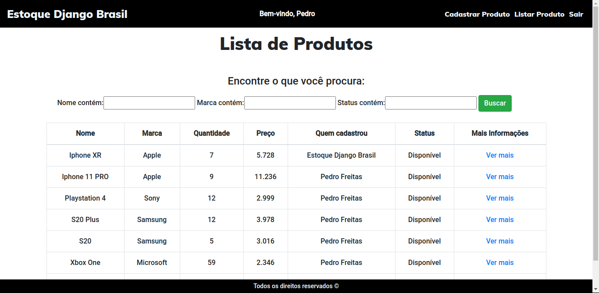

<h1 align="center">Estoque Django Brasil</h1>

	

	
	

> Status do Projeto: Em Desenvolvimento :warning:

## :large_blue_diamond: O Projeto 
Um sistema que facilita a verificação dos produtos em estoque de uma loja, mercado, microempreendedor individual e afins.

## :large_blue_diamond: Funcionalidades da aplicação 

:heavy_check_mark: Cadastro de produtos

:heavy_check_mark: Lista todos os produtos independente do usuário que o cadastrou

:heavy_check_mark: Detalhes dos produtos cadastrados

:heavy_check_mark: Filtro para pesquisar os produtos

:heavy_check_mark: Acesso apenas com autenticação

:heavy_check_mark: Layout Responsivo

:heavy_check_mark: Interface Intuitiva

	
	Lista de todos os produtos. Mostrando o usuário que o cadastou. Além do filtro para pesquisa.

## :large_blue_diamond: Como acessar
> Ainda não disponível.

### :large_blue_diamond: Pré-requesitos 

:exclamation: Python 3.6+

:exclamation: Pip (Gerenciador de Pacotes)

:exclamation: Django 3.0.x

### :large_blue_diamond: Para rodar a aplicação no seu dispositivo

- **Se você já possui os pré-requisitos instalados:**

	- No terminal do seu sistema operacional, rode o seguinte comando
	> **_git clone https://github.com/phdfreitas/controle-de-estoque.git_**

	- Entre na pasta do projeto
	> **_cd controle-de-estoque/_**

	- Entre na pasta base da aplicação
	> **_cd estoque/_**

	- Execute a aplicação
	> **_python manage.py runserver_**

	- No browser de sua preferência acesse
	> **_localhost:8000/_**

	**Teste, altere, divirta-se**