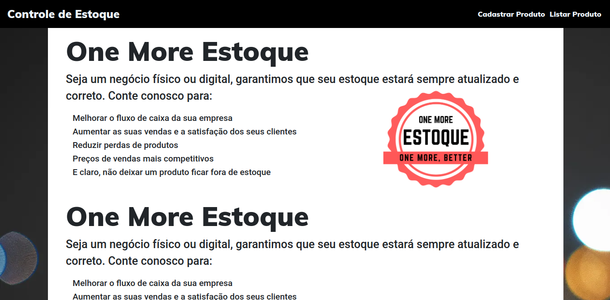

<h1 align="center">Controle de Estoque</h1>

> Status do Projeto: Em Desenvolvimento :warning:

## Sobre o Projeto
Desenvolver um sistema que facilite a verificação dos produtos em estoque de uma loja, mercado e afins.

	
	A imagem acima ainda não condiz com o resultado final do projeto.

## Funcionalidades do Sistema
- [x] Cadastrar Produtos
- [x] Listar Produtos
- [x] Detalhes dos Produtos Cadastrados
- [x] Atualizar dados dos Produtos
- [x] Excluir Produtos
- [x] Filtro para pesquisar produtos
- [ ] Cadastrar novos funcionários
- [ ] Nível de Acesso
- [ ] Layout Responsivo
- [ ] Interface Intuitiva

## Como acessar
> Ainda não disponível.

### Pré-requesitos
- :exclamation: Python 3.6+
- :exclamation: Django 3.0.x